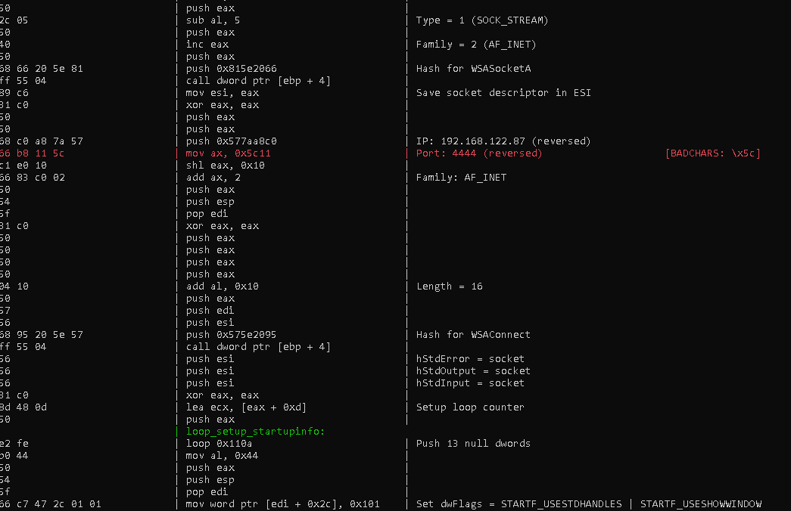
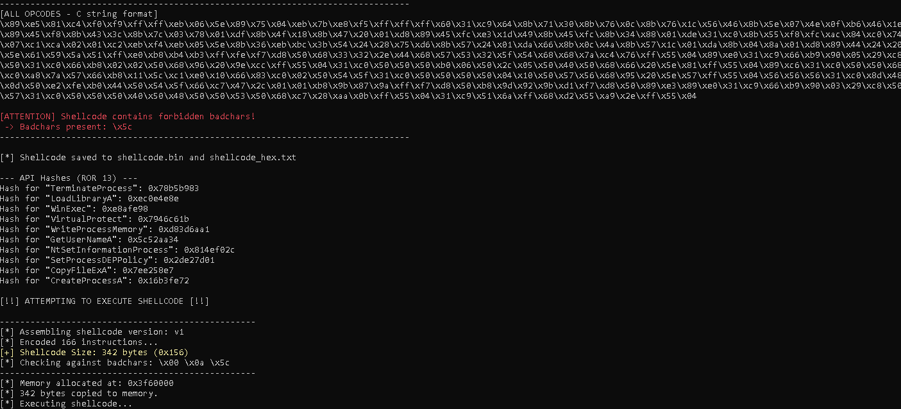

# KKSHELLCODE 🐚 Windows x86 Shellcode Assembler and Analyzer (Keystone/Capstone)

## Overview
This Python script serves as a foundational tool for **exploit development research** and **Capture The Flag (CTF)** challenges, specifically targeting the **Windows x86 (32-bit)** architecture. It utilizes the renowned **Keystone Engine** for assembly and the **Capstone Engine** for disassembly and detailed analysis.

The script includes two different Windows shellcode payloads, demonstrating key techniques like **dynamic API resolution** via hashing, **PEB traversal**, and **anti-bad character** encoding strategies crucial for reliable exploit writing.

### ⚠️ Disclaimer
This tool is intended for **ETHICAL HACKING**, **EDUCATIONAL**, and **RESEARCH PURPOSES ONLY**. By analyzing and using this script, you agree that you are solely responsible for any unlawful use. The development and analysis of shellcode are critical topics in security education (e.g., Offensive Security's OSED/OSCE/OSCP training). Always ensure you have explicit, written permission before testing on any system you do not own or have authorization for.

---

## ✨ Features
* **Multi-Version Shellcode:** Includes two distinct Windows x86 payloads (`v1`: `WinExec` and `v2`: Reverse Shell) for comparative study.
* **Assembly & Disassembly:** Assembles the raw assembly code using Keystone and then disassembles it using Capstone for verification.
* **Bad Character Analysis:** Checks the generated shellcode against a user-defined list of forbidden bytes (`--badchars`), highlighting problematic opcodes line-by-line in the disassembly listing.
* **Dynamic API Hashing Utility:** Includes a function to calculate ROR-13 hashes for Windows API functions, essential for implementing dynamic API resolution.
* **Windows Execution (Optional):** Ability to execute the generated shellcode directly on a Windows platform for testing and debugging (`--execute-x86`).
* **Output Formats:** Saves the shellcode to a raw binary file (`shellcode.bin`) and a C-style hexadecimal string (`shellcode_hex.txt`).



## 🛠️ Requirements

The script is written in Python 3 and requires the following libraries:
* `keystone-engine` (For assembling the code)
* `capstone` (For disassembling and analysis)
* `ctypes` (For Windows console colors and execution)
* `argparse` (For command-line arguments)
pip install keystone-engine capstone colorama

## Installation

1. Clone the repository:
git clone https://github.com/yourusername/kkshellcode.git
cd kkshellcode

2. Run the script directly (no further installation needed):

python shellcode_prova-01.py --help

## Usage

Run the script with various options. Basic syntax:
python shellcode_prova-01.py [-v VERSION] [--badchars "BADCHARS"] [--execute-x86]


### Options
- `-v, --version`: Select shellcode version (default: `v1`). Available: `v1` (executes `\\kali\met\met.exe`), `v2` (reverse shell example).
- `--badchars`: String of bad characters in hex format (e.g., `"\\x00\x0a\x0d"`). Checks and highlights them in output.
- `--execute-x86`: Execute the assembled shellcode in memory (Windows only; use with caution!).

### Examples

1. **Assemble default version (v1) and check for bad characters**:
`python shellcode_prova-01.py --badchars "\x00\x20\x09\x0d"`
- Outputs disassembly with comments, opcodes, and badchar warnings.
- Saves `shellcode.bin` and `shellcode_hex.txt`.

2. **Use version v2 and execute on Windows**:
`python shellcode_prova-01.py -v v2 --badchars "\x00\x0a" --execute-x86`
- Assembles a reverse shell shellcode.
- Attempts execution (ensure you're in a safe environment like a VM).

3. **No badchars check, just assemble and list**:
python shellcode_prova-01.py -v v1


### Output Sample
The tool prints a colorized disassembly listing with opcodes, instructions, and comments. It also shows overall badchar status (green for clean, red/blinking for issues) and API hashes for common functions like `WinExec` and `TerminateProcess`.

## How It Works

1. **Shellcode Selection**: Choose a version from the predefined assembly code blocks (e.g., `CODE_V1` for command execution).
2. **Assembly**: Uses Keystone to compile the assembly into bytes.
3. **Disassembly & Analysis**: Capstone disassembles the bytes, aligns with original comments, and checks each instruction for bad characters.
4. **Hash Calculation**: Computes ROR-13 hashes for APIs to match the shellcode's resolver logic.
5. **Execution**: On Windows, allocates RWX memory with `VirtualAlloc`, copies the shellcode, and runs it via a function pointer.
6. **ROP/DEP Enhancement**: Future versions may integrate ROP gadgets (e.g., from corelanc0d3r's article) and DEP bypass techniques (e.g., `VirtualProtect` or `NtSetInformationProcess`).

### Adding New Shellcode Versions
To add a new version (e.g., `v3`):
- Edit the script and add a new entry to `SHELLCODE_VERSIONS`, like:

```
"v3": r"""
; Your assembly code here...
"""
```

- It will automatically be available via `-v v3`.

## Warnings
- **Execution Risk**: The `--execute-x86` flag runs arbitrary code in memory. Use only in isolated environments (e.g., VMs) to avoid system compromise.
- **Platform**: Execution is Windows-only due to `ctypes` and WinAPI dependencies. Assembly/disassembly works cross-platform.
- **Bad Characters**: The tool avoids common badchars like `\x00` in its opcodes through techniques like negation and indirect offsets.
- **Legal Note**: This tool is for educational and research purposes only. Do not use for malicious activities.

## License
MIT License. See [LICENSE](LICENSE) for details.

## Credits
- Assembly engines: Keystone and Capstone.
- Original shellcode based on common exploit patterns (e.g., API resolution via PEB and hashing).

Contributions welcome! Open an issue or PR for bugs, features, or new shellcode versions, especially ROP or DEP bypass enhancements.
